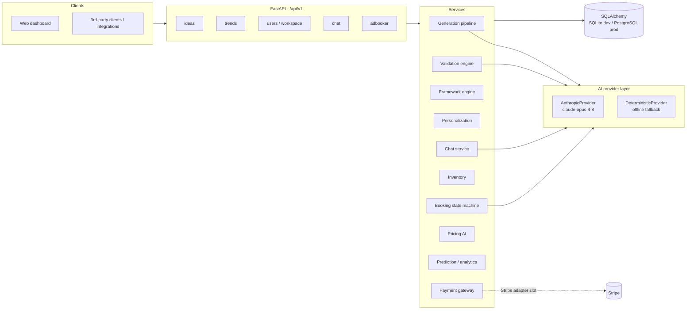

# Architecture

## System overview

IdeaBrowser Reimagined is an API-first, modular monolith: one FastAPI
application composed of independently testable service modules over a shared
relational store. Every capability is exposed as a versioned REST endpoint
(`/api/v1/...`); the bundled web dashboard is just another API client.



## Layering rules

| Layer | Lives in | May import |
|---|---|---|
| API routers | `app/api/` | schemas, services, models, database |
| Services (domain logic) | `app/services/` | models, schemas, AI layer |
| AI providers | `app/ai/` | schemas only |
| Models (persistence) | `app/models/` | database only |
| Schemas (contracts) | `app/schemas/` | nothing internal |

Routers stay thin: parse/validate, call one service function, commit, shape
the response. All domain rules (state machines, scoring formulas, pricing
factors) live in services and are covered by unit tests without HTTP.

## The idea lifecycle

```
signals + trends ──▶ Generation ──▶ Idea (structured record)
                                        │
                          ┌─────────────┼────────────────┐
                          ▼             ▼                ▼
                   Validation      Framework         Founder fit
                   (7 dimensions)  engine (x4)       (per user)
                          │             │                │
                          └───── full IdeaReport ────────┘
                                        │
                     daily idea · database · recommendations · chat
```

1. **Generation** — trend/signal context is handed to the AI provider, which
   returns a schema-validated `IdeaDraft` (structured outputs). Drafts are
   persisted with slug de-duplication and immediately analyzed, so no idea
   exists without its analysis.
2. **Validation** — seven dimension scores (problem severity, market
   potential, timing, demand evidence, competition gap, feasibility,
   monetization) are *deterministic functions* of the idea's data, signals,
   keywords, and competitors. The AI layers a qualitative narrative and
   verdict on top. Every run is an immutable snapshot, preserving history.
3. **Frameworks** — Value Equation, A.C.P., Market Matrix, and Value Ladder
   are pure scoring functions producing scores + classification +
   recommendations, upserted one row per framework.
4. **Personalization** — founder fit combines skill overlap, interest
   alignment, capital readiness, and time-vs-difficulty; recommendations
   blend idea quality (55%) with fit (45%).

### Why deterministic scores + AI narrative?

Scores must be *comparable across ideas* and *reproducible* — an LLM asked
to emit "market_potential: 73" is neither. So numbers come from auditable
formulas over verifiable data, and the LLM does what it is good at:
synthesis, nuance, and next-step advice. This also means the whole platform
degrades gracefully to the deterministic backend when no API key is present.

## AI provider layer

`app/ai/base.py` defines a four-method protocol (`draft_idea`,
`analyze_idea`, `review_creative`, `chat`). Two implementations:

- **AnthropicProvider** — `claude-opus-4-8` with adaptive thinking;
  structured artifacts via `client.messages.parse` + Pydantic output formats
  (schema-guaranteed), chat via plain messages. Selected automatically when
  `ANTHROPIC_API_KEY` is set.
- **DeterministicProvider** — seeded heuristics with identical output
  shapes. Powers offline demos and the test suite (zero network, zero flake).

Adding a new backend = one class + one branch in the factory. Nothing else
in the codebase knows which backend is active.

## AdBooker module

AdBooker is a vertical slice with its own service package
(`app/services/adbooker/`) sharing only `User` and the payments interface
with the core platform.

- **Inventory** materializes bookable slots lazily (send-day x placement x
  position) — idempotent, so the calendar endpoint can safely extend the
  horizon on every read.
- **Booking** is a strict state machine
  (`awaiting_assets → awaiting_approval → awaiting_payment → confirmed →
  delivered → completed`, cancellable pre-delivery with automatic refund).
  Illegal transitions raise and map to HTTP 409.
- **Pricing AI** multiplies four bounded factors (demand/occupancy, lead
  time, weekday, realized-performance premium) over the placement base
  price; no factor can move price more than ~35%, keeping suggestions
  explainable (each response includes the factor breakdown).
- **Prediction** forecasts impressions/clicks from audience math, placement
  CTR multipliers, delivered-ad history, and the AI creative score, with a
  confidence grade tied to history depth.
- **Creative optimization** runs on every asset upload: the AI provider
  scores the creative and attaches suggestions before the operator reviews.
- **Payments** go through a `PaymentGateway` protocol; the mock gateway
  ships in-repo, and a Stripe adapter drops in behind the same two methods
  (`charge`, `refund`) selected by `IDEABROWSER_PAYMENTS=stripe`.

## Scalability & operations

- **Stateless app** — all state in the database; horizontal scaling is a
  load balancer away. SQLite for dev, PostgreSQL via one env var
  (`IDEABROWSER_DATABASE_URL`) for prod; only portable column types are used.
- **Async-ready boundaries** — generation/validation are single service
  calls, ready to move onto a task queue (Celery/ARQ) for batch nightly
  generation without API changes.
- **Caching path** — idea reports are snapshot-shaped (immutable
  `ValidationReport` rows), making CDN/redis caching of `GET /ideas/{slug}`
  straightforward.

## Security & privacy

- Payment card data never touches the platform — gateway tokenization only;
  the DB stores amounts, invoice numbers, and provider references.
- Auth is intentionally out of scope for this reference implementation; the
  intended production shape is JWT bearer auth at the router layer with
  role checks (founder/operator/sponsor already modeled on `User.role`).
- User-submitted content is validated at the Pydantic boundary; the web
  dashboard HTML-escapes all API data before rendering.
