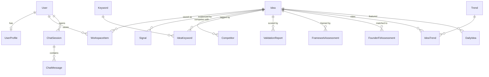
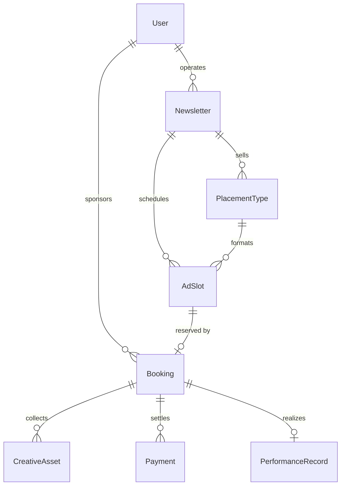

# Data Model

## Core domain



### Idea

The central record. Narrative fields (`problem_statement`,
`solution_overview`, `why_now`) are text; structured sub-documents are JSON
columns written/read as whole units by the analysis pipeline, with shapes
enforced at the Pydantic layer:

| JSON column | Shape |
|---|---|
| `target_audience` | `{segments[], demographics, psychographics, needs[]}` |
| `market` | `{tam_usd, sam_usd, som_usd, cagr_pct, revenue_potential_usd_yr}` |
| `business_model` | `{model, revenue_streams[{name, kind, pricing}], price_point_usd}` |
| `go_to_market` | `{channels[], first_100_customers, growth_loops[]}` |
| `execution` | `{difficulty_1_10, time_to_mvp_weeks, capital_usd, required_skills[]}` |
| `visual_assets` | `[{kind, url, caption}]` |

`status`: `candidate → curated → archived`. `source`: `generated` \|
`user_submitted`.

### Evidence tables

- **Signal** — one demand/proof observation (`source`: reddit, x, google
  trends, news, academic, patents...; `kind`: community_discussion,
  complaint, search_growth, funding, launch; `strength` 0–1). Feeds the
  `demand_evidence` and `timing` validation dimensions and the Value
  Equation's likelihood term.
- **Keyword** — global search-term telemetry (volume, YoY growth,
  competition, CPC), linked many-to-many via `IdeaKeyword.relevance`.
- **Competitor** — direct/indirect entries with positioning,
  strengths/weaknesses, threat level. Validation treats ~3 competitors as
  optimal (proof of market without saturation).
- **Trend** — named market movement with `momentum` (0–100, computed from
  keyword volume + growth) and `stage` (emerging/accelerating/peaking/
  declining). Ideas link via `IdeaTrend`.

### Analysis snapshots

- **ValidationReport** — append-only; each row is one full validation run
  (`overall_score`, 7-dimension JSON, verdict, narrative, `generated_by`
  backend). History is never overwritten, enabling score-over-time views.
- **FrameworkAssessment** — one row per (idea, framework), upserted:
  `value_equation`, `acp`, `market_matrix`, `value_ladder`; each carries
  `scores` JSON, `classification`, analysis text, `recommendations`.
- **FounderFitAssessment** — one row per (idea, user): score, matched
  skills, gaps, rationale.

## AdBooker domain



- **Newsletter** — audience stats (`audience_size`, `open_rate`,
  `click_rate`) and `send_days` (weekday ints) drive slot generation and
  prediction math.
- **PlacementType** — a sellable format (base price, `max_per_issue`,
  `ctr_multiplier` relative to newsletter average).
- **AdSlot** — one bookable unit: `(newsletter, placement, run_date,
  position)` unique. `price_cents` is the *current dynamic* price;
  `status`: available → booked → delivered.
- **Booking** — the transactional aggregate. Status machine (enforced in
  code, documented in `Booking.TRANSITIONS`):

  ```
  awaiting_assets → awaiting_approval → awaiting_payment → confirmed
        ▲                  │                                   │
        └── (rejection) ───┘                     delivered → completed
  cancelled ◀── any pre-delivery state (auto-refund if paid)
  ```

- **CreativeAsset** — sponsor uploads (`headline`, `body_copy`, `cta`,
  `image`, `logo`, `landing_url`); `ai_review` JSON holds the automatic
  creative score + suggestions; `status` pending/approved/rejected with
  operator feedback.
- **Payment** — ledger-style rows (refunds are negative-amount rows), with
  provider reference and generated invoice number. Card data never stored.
- **PerformanceRecord** — realized impressions/clicks/conversions per
  delivered booking; the training signal for pricing and prediction.

## Conventions

- Money is integer cents; rates are 0–1 floats; scores are 0–100 floats.
- JSON columns are used only for document-shaped data owned by a single
  writer path; anything queried/filtered relationally gets a real table.
- All timestamps are UTC naive (`datetime.utcnow`).
